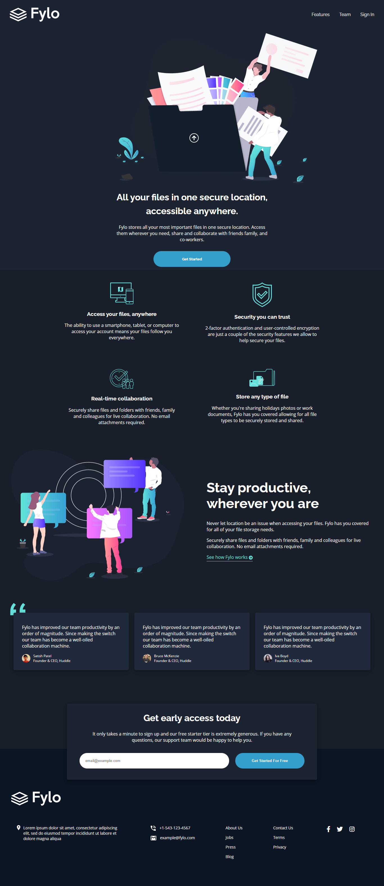
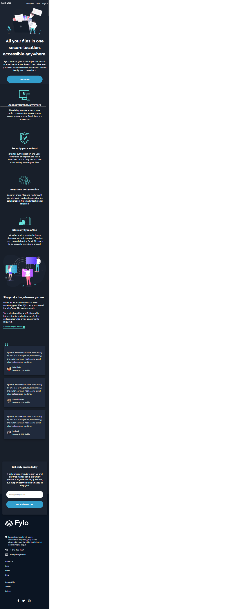

# Frontend Mentor - Fylo dark theme landing page solution

This is a solution to the [Sidehustle Internship frontend design task: Fylo dark theme landing page challenge on Frontend Mentor](https://www.frontendmentor.io/challenges/fylo-dark-theme-landing-page-5ca5f2d21e82137ec91a50fd). Frontend Mentor challenges help you improve your coding skills by building realistic projects. 

## Table of contents

- [Overview](#overview)
  - [The challenge](#the-challenge)
  - [Screenshot](#screenshot)
  - [Links](#links)
- [My process](#my-process)
  - [Built with](#built-with)
  - [What I learned](#what-i-learned)
  - [Continued development](#continued-development)
  - [Useful resources](#useful-resources)
- [Author](#author)
- [Acknowledgments](#acknowledgments)

## Overview

## The challenge

Users should be able to:

- View the optimal layout for the site depending on their device's screen size
- See hover states for all interactive elements on the page

### Screenshot




### Links

- Solution URL: [https://www.frontendmentor.io/challenges/fylo-dark-theme-landing-page-5ca5f2d21e82137ec91a50fd]

- Live Site URL: [https://sidehustle-frontend-design-task-2.netlify.app/]

## My process

### Built with

- Semantic HTML5 markup
- CSS custom properties
- Flexbox
- Desktop-first workflow

### What I learned

Structuring out each sections of the page design with numerous html elements allowed me to focus on section before proceeding to the other section, it helped me to easily apply the css styling with much ease and along the way I saw the benefit of some html tag and css properties to use. Below are some code and pattern design that I Like.

```html
<div class="landing-wrapper">
  <div class="landing">
      
      <h1>All your files in one secure location, accessible anywhere.</h1>
      <div class="illustration-desc">
          Fylo stores all your most important files in one secure location. 
          Access them wherever you need, share and collaborate with friends family, and co-workers.
      </div>
      <div class="get-started-btn">
          <button type="button">Get Started</button>
      </div>
  </div>
</div>
```
```css
.footer-item:nth-child(5) {

}

body .content .testimonial-wrapper .quote {
    position: absolute;
    left: 36px;
    top: -25px;
    z-index: 1;
}
```

### Continued development

I feel I'm not well grounded in CSS Flexbox and It is something I will have to work more on in order to develop robust responsive webpage.

### Useful resources

- [css-trick](https://css-tricks.com/) - This helped me on how to center image
- [Mozilla developer nextwork]https://developer.mozilla.org/ - This resource helped in understanding how to use media query

## Author

- Twitter - [@DexterousGodson](https://twitter.com/@DexterousGodson)
- Github - [Dexterouz](https://github.com/Dexterouz)

## Acknowledgments

Hats off to the mentors @Sidehustle Internship for valuable time they have given to mentor me and my fellow along our journey in becoming a frontend developer. I say Gracias